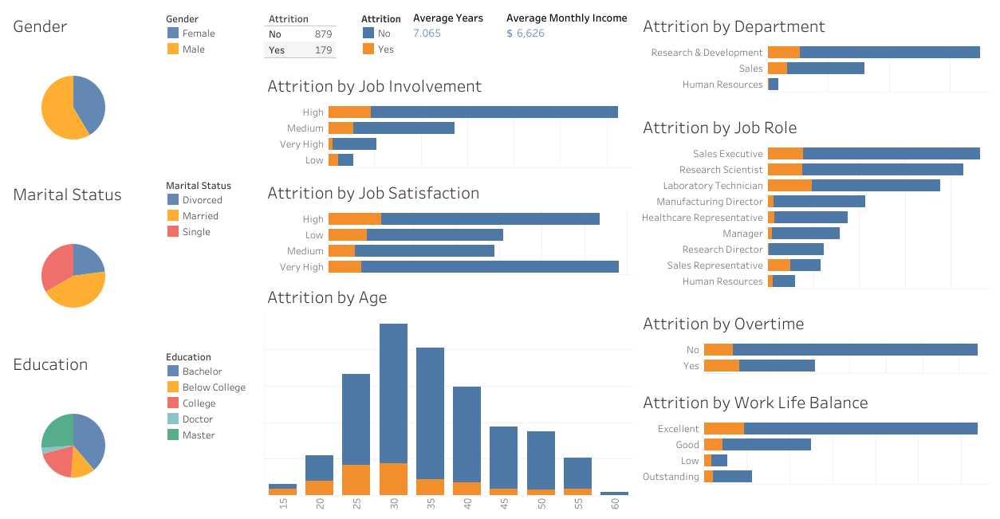

# Proyek Pertama: Analisis dan Prediksi *Employee Attrition*

## Latar Belakang

Perusahaan **Jaya Jaya Maju** mengalami masalah tingkat *attrition* karyawan \>10%. Proyek ini bertujuan untuk:

1.  Menganalisis faktor-faktor yang mempengaruhi *employee attrition*
2.  Membangun model prediktif untuk mengidentifikasi risiko *attrition*
3.  Membuat *dashboard* prediksi interaktif untuk HR

## Struktur Direktori

├──`employee_data_cleaned.csv`\
├──`model.joblib`\
├──`prediction.py`\
├──`notebook.ipynb`\
├──`requirements.txt`\
├──`README.md`\
├──`dashboard-preview.png`

## Link ke Dashboard Tableau Public

Anda dapat mengakses dashboard interaktif melalui tautan berikut:

[Jaya Jaya Maju Employees Attrition Dashboard](https://public.tableau.com/views/JayaJayaMajuEmployeesAttritionDashboard/Dashboard1?:language=en-US&:sid=&:redirect=auth&:display_count=n&:origin=viz_share_link)

## Tampilan Dashboard

Berikut adalah tampilan *screenshot* dari *dashboard* yang telah dibuat:



## Cara Menjalankan Proyek

### Instalasi

```bash
# Clone repositori
git clone https://github.com/107rasyid/Menyelesaikan-Permasalahan-Human-Resources
```

### Buat virtual environment
```bash
python -m venv venv
```

### Aktifkan virtual environment
### Untuk Linux/MacOS:
```bash
source venv/bin/activate
```

### Untuk Windows:
```bash
.\venv\Scripts\activate
```

### Install dependencies
```bash
pip install -r requirements.txt
```

## Menjalankan Aplikasi Predict
```bash
`streamlit run src/prediction.py`
```
Buka *browser* di `http://localhost:8501`\
Isi *form input* sesuai data karyawan\
Klik tombol **Predict Attrition**

## Hasil Analisis

### Faktor Penentu *Attrition*

| Peringkat | Fitur            | Tingkat Pengaruh |
| --------- | ---------------- | ---------------- |
| 1         | `OverTime`       | 11.9%            |
| 2         | `MonthlyIncome`  | 9.65%            |
| 3         | `Age`            | 8.54%            |
| 4         | `DailyRate`      | 8.01%            |
| 5         | `StockOptionLevel` | 7.96%            |

### Performa Model Prediksi *Attrition*

### Performa Model Prediksi *Attrition*

Model *Gradient Boosting Classifier* dimanfaatkan untuk memprediksi risiko seorang karyawan meninggalkan perusahaan (*attrition*). Proses pelatihan model ini melibatkan analisis data karyawan yang ada, dengan mengandalkan serangkaian **fitur utama sebagai input prediksi**. Fitur-fitur tersebut mencakup `Age`, `BusinessTravel`, `DailyRate`, `Department`, `DistanceFromHome`, `Education`, `EnvironmentSatisfaction`, `Gender`, `JobInvolvement`, `JobLevel`, `JobRole`, `JobSatisfaction`, `MaritalStatus`, `MonthlyIncome`, `MonthlyRate`, `NumCompaniesWorked`, `OverTime`, `PercentSalaryHike`, `PerformanceRating`, `RelationshipSatisfaction`, `StockOptionLevel`, `TotalWorkingYears`, `TrainingTimesLastYear`, `WorkLifeBalance`, `YearsAtCompany`, `YearsInCurrentRole`, `YearsSinceLastPromotion`, dan `YearsWithCurrManager`. Melalui pembelajaran dari pola data historis, model ini mampu mengidentifikasi karyawan dengan karakteristik serupa dengan mereka yang telah mengalami *attrition* sebelumnya.

### Performa Model

| Metric    | Training | Testing |
| --------- | -------- | ------- |
| Accuracy  | 0.97     | 0.88    |
| Precision | 0.96     | 0.85    |
| Recall    | 0.98     | 0.89    |
| F1-Score  | 0.97     | 0.87    |

## Kesimpulan

Berdasarkan analisis data karyawan, beberapa faktor signifikan berkontribusi terhadap tingkat *attrition* di perusahaan Jaya Jaya Maju.

* **Faktor Pengaruh Utama:** *OverTime* menjadi faktor dengan tingkat kepentingan tertinggi dalam memprediksi *attrition* (0.119), diikuti oleh *MonthlyIncome* (0.097), *Age* (0.085), *DailyRate* (0.081), dan *StockOptionLevel* (0.080).
* **Demografi Karyawan:** Mayoritas pekerja adalah laki-laki dan sebagian besar telah menikah dengan tingkat pendidikan sarjana sebagai yang dominan.
* **Attrition Rate Berdasarkan Departemen:** Departemen *Sales* menunjukkan tingkat *attrition* tertinggi (20.69%), diikuti oleh *Human Resources* (15.79%) dan *Research & Development* (15.26%).
* **Attrition Berdasarkan Peran:** Posisi *Sales Representative* memiliki tingkat *attrition* tertinggi (43.10%), diikuti oleh *Laboratory Technician* (26.06%) dan *Human Resources* (20.00%).
* **Attrition Rate Berdasarkan Usia:** Pekerja dengan usia muda (terutama rentang 15-24 tahun) memiliki tingkat *attrition* yang lebih tinggi (60.00% untuk 15-19 dan 36.36% untuk 20-24). Tingkat *attrition* cenderung menurun seiring bertambahnya usia, namun kembali meningkat pada kelompok usia 55-59 tahun (17.65%).
* **Keterlibatan Kerja:** Karyawan dengan tingkat keterlibatan kerja rendah memiliki kecenderungan *attrition* yang lebih tinggi.
* **Work-Life Balance:** Karyawan dengan *work-life balance* rendah memiliki tingkat *attrition* tertinggi.
* **Kepuasan Kerja:** Tingkat kepuasan kerja yang rendah berkorelasi dengan tingkat *attrition* yang lebih tinggi.
* **OverTime:** Karyawan yang sering bekerja lembur memiliki tingkat *attrition* yang jauh lebih tinggi (31.92%) dibandingkan dengan mereka yang tidak (10.79%).
* **StockOptionLevel:** Tingkat opsi saham 0 memiliki tingkat *attrition* tertinggi (25.69%).

## Rekomendasi Action Items

Berdasarkan kesimpulan di atas, perusahaan Jaya Jaya Maju dapat mempertimbangkan tindakan berikut:

1.  **Intervensi Terkait OverTime:** Evaluasi beban kerja dan kebijakan lembur, pertimbangkan kompensasi atau insentif tambahan untuk lembur, atau cari cara untuk mengurangi kebutuhan lembur.
2.  **Strategi Retensi untuk Departemen dan Peran dengan Attrition Tinggi:** Kembangkan strategi retensi yang ditargetkan untuk departemen *Sales* dan posisi *Sales Representative*, *Laboratory Technician*, dan *Human Resources*.
3.  **Program untuk Karyawan Usia Muda:** Implementasikan program yang mendukung karyawan di awal karir mereka, seperti mentoring, peluang pengembangan, dan peningkatan keterlibatan.
4.  **Fokus pada Keterlibatan dan Kepuasan Kerja:** Investasikan dalam inisiatif untuk meningkatkan keterlibatan kerja dan kepuasan kerja karyawan secara keseluruhan, dengan perhatian khusus pada mereka yang melaporkan tingkat keterlibatan dan kepuasan yang rendah.
5.  **Promosikan Work-Life Balance:** Tinjau dan tingkatkan kebijakan dan budaya kerja untuk mendukung *work-life balance* karyawan.
6.  **Evaluasi Kebijakan Opsi Saham:** Pertimbangkan kembali kebijakan opsi saham untuk membuatnya lebih menarik, terutama bagi karyawan yang belum memiliki opsi saham.
7.  **Analisis Lebih Lanjut:** Lakukan analisis lebih mendalam untuk memahami alasan spesifik di balik tingkat *attrition* yang tinggi di departemen, peran, dan kelompok usia tertentu.

## Kontak

- Nama: Rasyid Alfiansyah
- Email: `rasyidalfiansyh@gmail.com`
- Dicoding ID: rasyidalfiansyh
